# Assignment 1
Name: 'Your real name'

Legi-Nr: 'Your legi number'

## Required results
Edit this 'README.md' file to report all your results. You only need to update the tables in the reports section by adding screenshots and reporting results.

### Tasks
- Add a text dump of the content of the two data structures for the provided mesh “plane.off”.

- Show three screenshots of the 'fandisk.off' model using 'per-face shading', 'per-vertex shading' and 'per-corner shading'. Describe the difference between them.

- Show screenshots of the provided meshes with each connected component colored differently. Show the number of connected components and the size of each component (measured in number of faces) for all the provided models.

- Show screenshots of the subdivided meshes.

## Reports
### text dump of the data structure for "plane.off"
|Vertices-to-Face      | Vertices-to-Vertex  |
| :------------------- |:------------------- |
| vertex 0: 5 21 |  vertex 0: 11 13 22 |
vertex 1: 31 | vertex 1: 9 12 |
vertex 2: 10 26 | vertex 2: 10 15 23 |
vertex 3: 0 | vertex 3: 14 16 |
vertex 4: 14 27 30 | vertex 4: 9 10 20 24 |
vertex 5: 13 23 29 | vertex 5: 11 12 19 24 |
vertex 6: 1 4 17 | vertex 6: 13 14 18 21 |
vertex 7: 2 8 18 | vertex 7: 15 16 17 21 |
vertex 8: 6 9 12 19 22 25 | vertex 8: 17 18 19 20 22 23 |
vertex 9: 15 30 31 | vertex 9: 1 4 12 24 |
vertex 10: 11 26 27 | vertex 10: 2 4 20 23 |
vertex 11: 7 21 23 | vertex 11: 0 5 19 22 |
vertex 12: 15 29 31 | vertex 12: 1 5 9 24 |
vertex 13: 4 5 20 | vertex 13: 0 6 18 22 |
vertex 14: 0 1 16 | vertex 14: 3 6 16 21 |
vertex 15: 8 10 24 | vertex 15: 2 7 17 23 |
vertex 16: 0 2 16 | vertex 16: 3 7 14 21 |
vertex 17: 3 8 9 18 19 24 | vertex 17: 7 8 15 18 21 23 |
vertex 18: 3 4 6 17 19 20 | vertex 18: 6 8 13 17 21 22 |
vertex 19: 7 12 13 22 23 28 | vertex 19: 5 8 11 20 22 24 |
vertex 20: 11 12 14 25 27 28 | vertex 20: 4 8 10 19 23 24 |
vertex 21: 1 2 3 16 17 18 | vertex 21: 6 7 14 16 17 18 |
vertex 22: 5 6 7 20 21 22 | vertex 22: 0 8 11 13 18 19 |
vertex 23: 9 10 11 24 25 26 | vertex 23: 2 8 10 15 17 20 |
vertex 24: 13 14 15 28 29 30 |vertex 24: 4 5 9 12 19 20 |

### Show three screenshots of the 'fandisk.off' model using different shading. Make sure you disable the wireframe and that the screenshots clearly show the differences between the different shading types.
| model name  | per-face shading    | per-vertex shading |  per-corner shading |
| :---------: | ------------------- | ------------------ | ------------------- |
| fandisk     |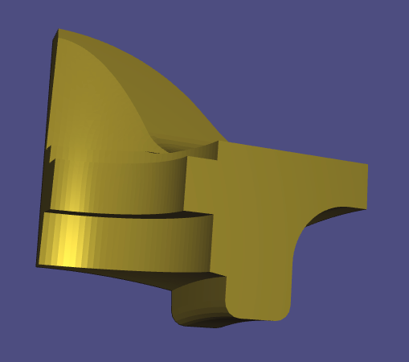| 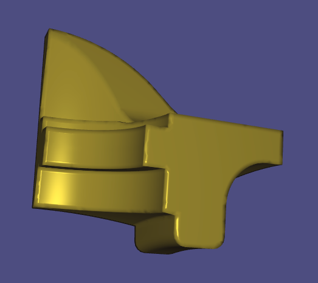 |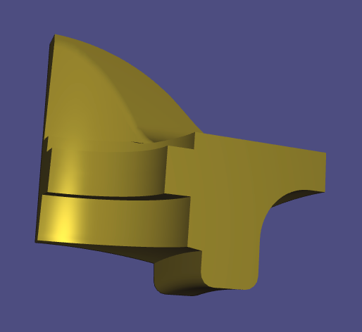  |

#### Briefly describe the difference between the different shading types.
In comparison with the other two, the edges of the per-vertex shading model are more blurred. In addition, compared to the per-face shading model, specular highlights of the per-vertex shading model are rendered better.\
In comparison to the other two, the angles between the faces of the per-face shading model are more obvious.\
In comparison to per-vertex shading, the edges of the per-corner shading is sharper.

### Assign different colors to each connected component

| model name   | your results                                                  |  no. of components | no. of faces per component |
| :----------: | ------------------------------------------------------------  |:-----------------: | :------------------------: |
|bumpy_cube    |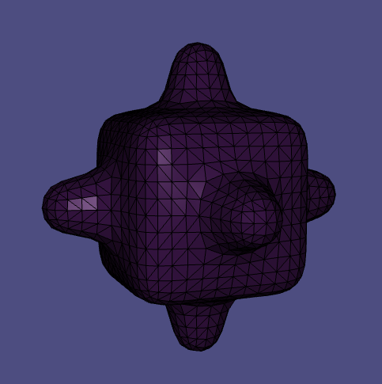  |   1                |  2496               |
|bunny         |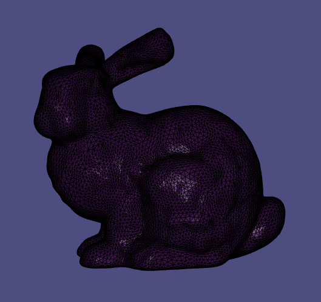  |   1                |  27864                 |
|coffeecup     |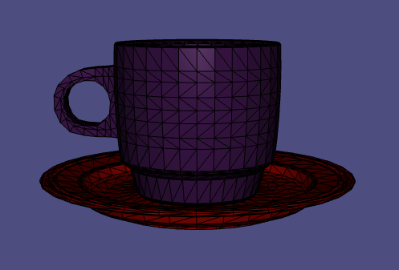  |   2                | 3360/2304               |
|honda         |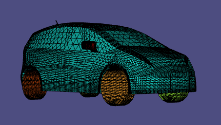  |   11               | 90/192/192/13216/704/1088/1088/1088/1088/736/736 |

### Screenshots of subdivided meshes. Make sure you enable the wireframe overlay.

| model name | original shape                                               | subdivided shape                                             |
| :--------: | ------------------------------------------------------------ |------------------------------------------------------------- | 
| plane      | | |
| sphere     |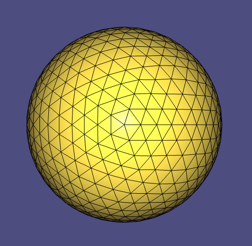 |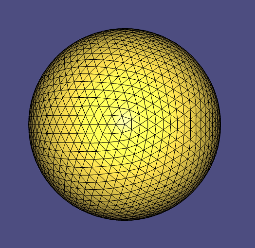 |
| bunny      |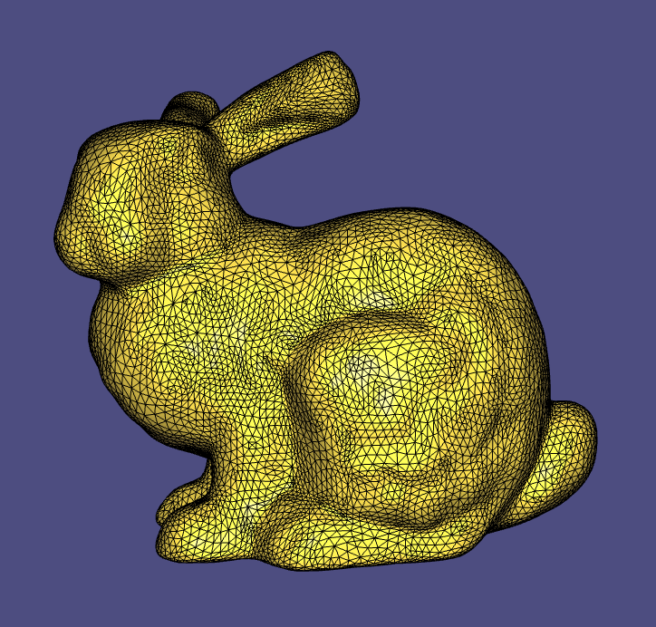 |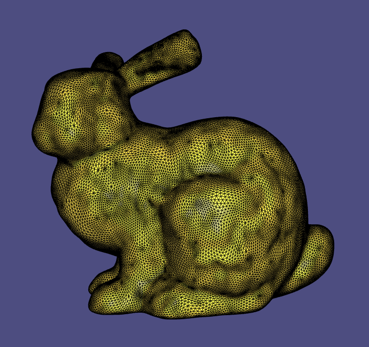 |
| bumpy_cube |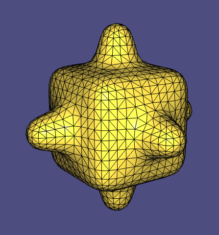 |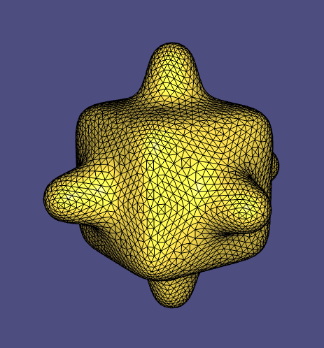 |

