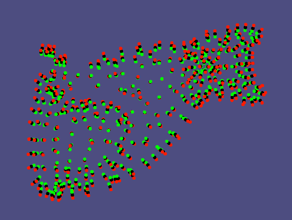
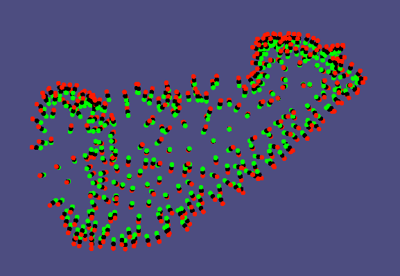
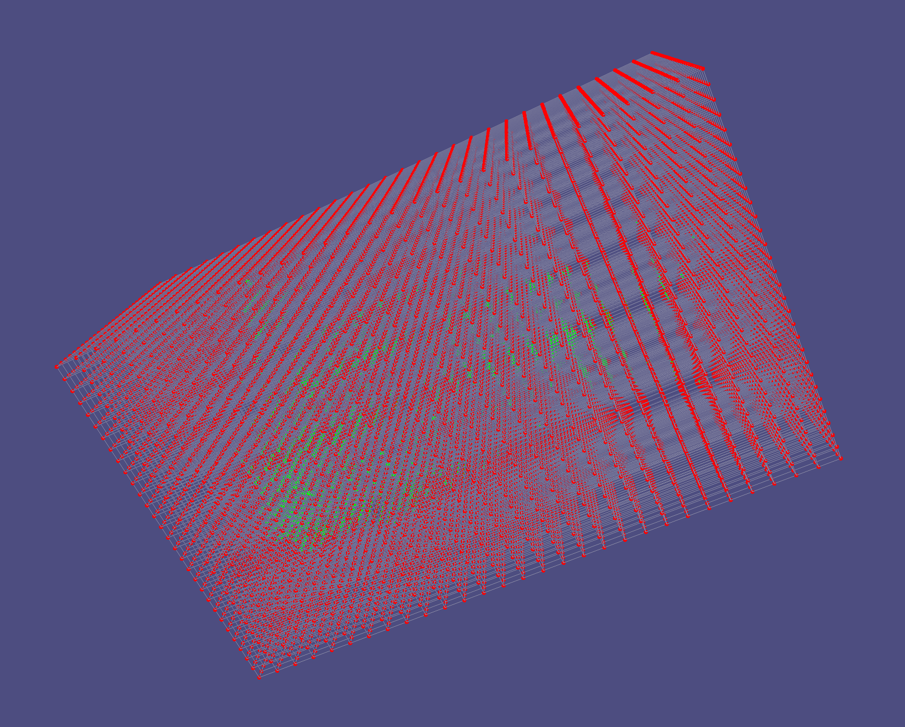
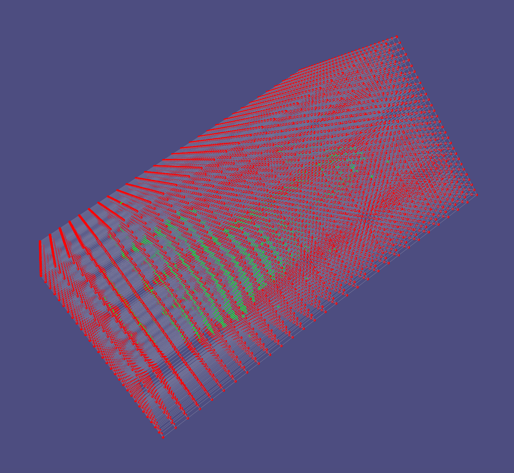
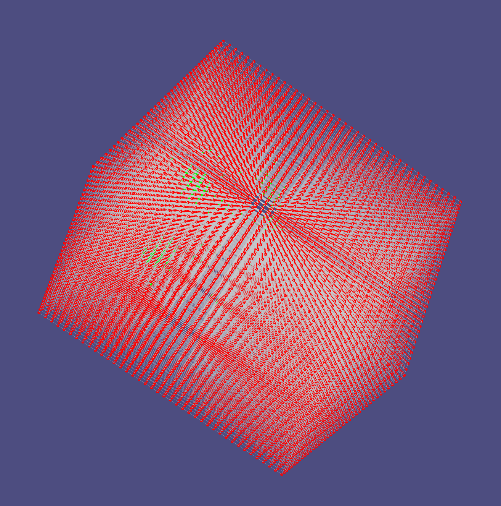
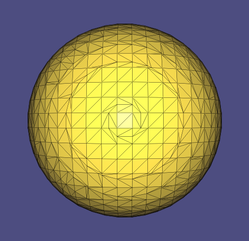
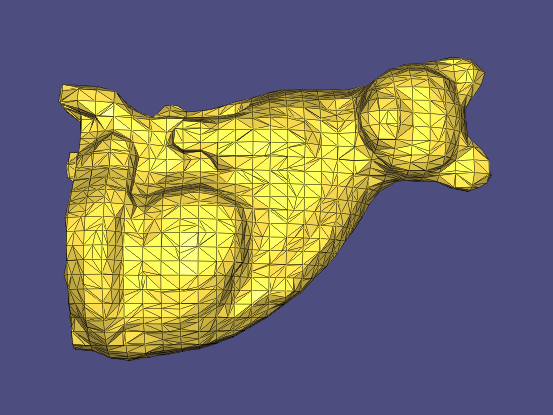
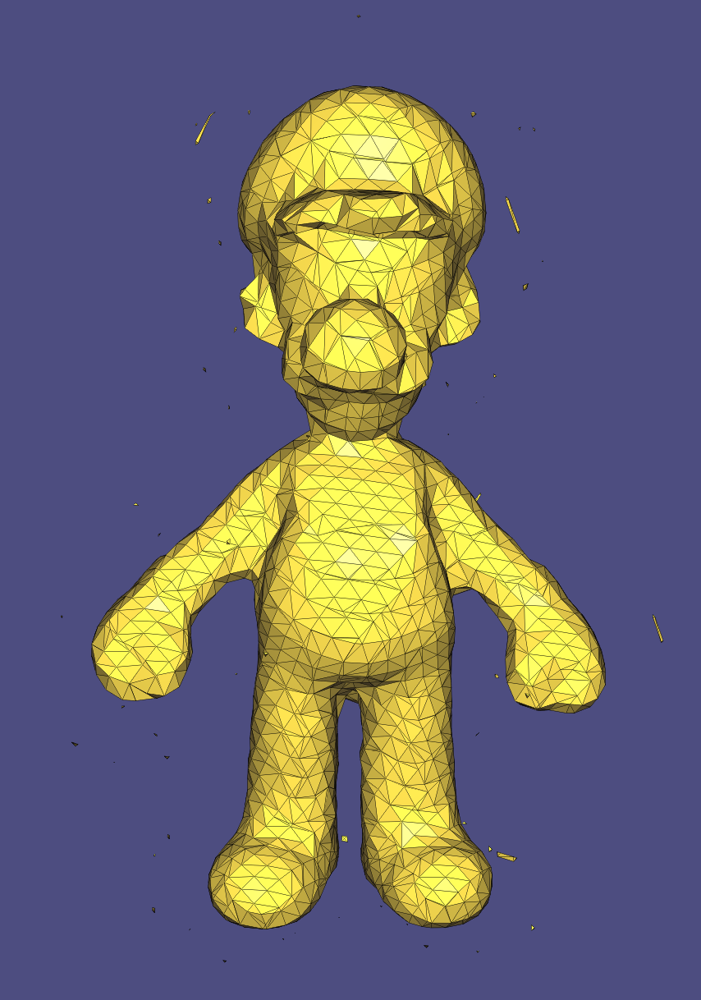
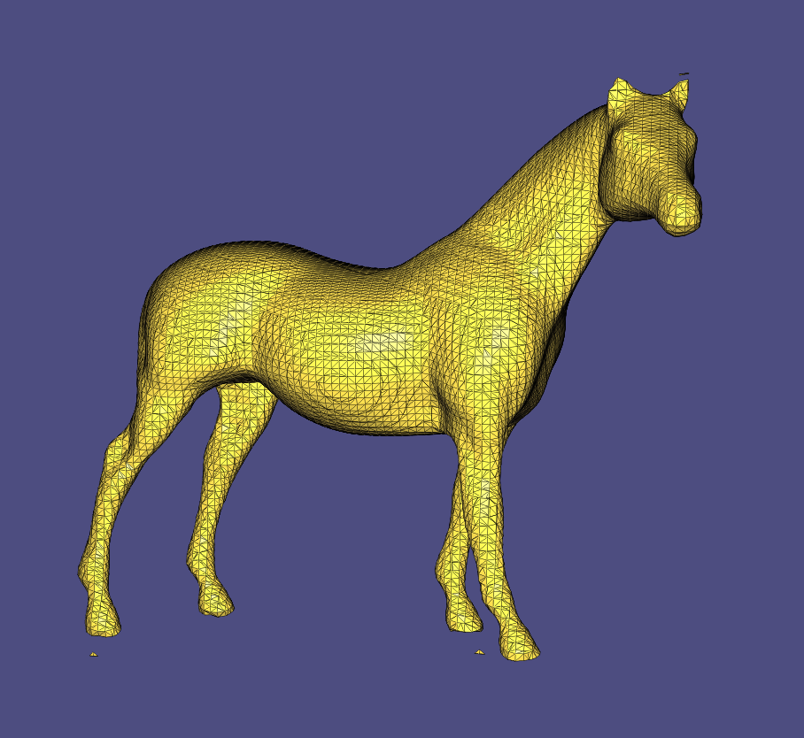
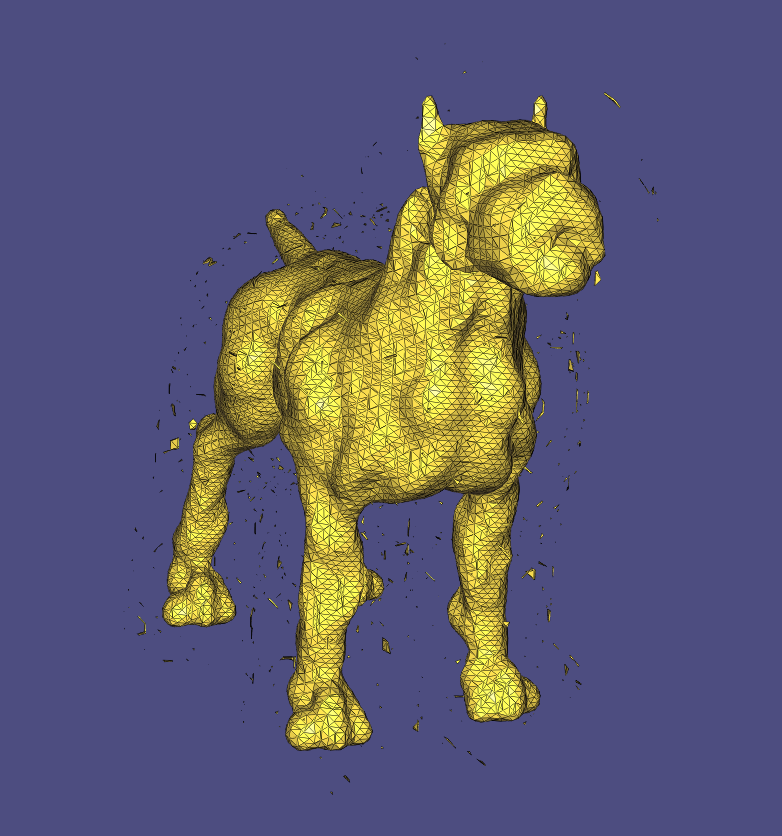

# Assignment 2
Name: 'Di Zhuang'

Legi-Nr: '21958772'

## Required results
Edit this 'README.md' file to report all your results. You only need to update the tables in the reports section by adding screenshots and reporting results.

### Tasks
1) Show the visualization of the constrained points for the 'cat.off' point cloud.

2) Show screenshots of the grid with nodes colored according to their implicit function values (cat.off and luigi.off).

3) Show screenshots of the reconstructed surfaces. Experiment with different parameter settings: grid resolution (also anisotropic in the 3 axes), Wendland function radius, polynomial degree. Add all these settings to the GUI to ease experimentation. Briefly summarize your observations and save the reconstructed models in the .off format for every point-cloud dataset provided (assignment2/results).

4) Theory question (1): Save your notes to assignment2/results and link to them from within the report.

5) Theory question (2): Save your notes to assignment2/results and link to them from within the report.

6) Show screenshots comparing the 'hound.off' computed with normal-based reconstruction to the point-based reconstruction of the previous task.

7) Compare your MLS reconstruction results to the surfaces obtained with RIMLS and Screened Poisson Reconstruction, and inspect the differences. Report your findings.

8) Show screenshorts of your method for estimating normals based on Principal Component Analysis. Compare the results with the reconstruction obtained using the provided normals.

## Reports
### 1 - Visualization of the 'cat.off' point cloud with constrained points
| model name  | view 01             | view 02            |
| :---------: | ------------------- | ------------------ |
| cat         ||  |

The difference between spatial-index method and no-spatial-index method is not obvious for cat.off. Instead, I tested these two methods on a denser point cloud horse.off, with resolution of the grids equal to epsilon. This gives 0.16 seconds for spatial-index method and 4 seconds for non-spatial-index method.

### 2 - Grid with nodes colored w.r.t. the implicit function (using the non-axis-aligned grid as described in Section 2.3) 
| model name  | view 01             | view 02            |
| :---------: | ------------------- | ------------------ |
| cat (polyDegree = 0, resolution = 30, wendlandRadius = 100)         ||  |
| luigi (polyDegree = 0, resolution = 40, wendlandRadius = 10)      ||  |

### 3 - Reconstructed surfaces
**Please also save the reconstructed shape (.off) in the results folder**

| sphere                                                     | cat                                                           |
| :--------------------------------------------------------: |  :----------------------------------------------------------: | 
||  |
| luigi                                                      | horse                                                         |
||  |
| hound                                                     |                                                               |
||                                                               |

**Please summarize your observations of what happens when you change the following parameters. Please feel free to add screenshots (by creating a separate table) to illustrate your explanation.**

| params                   | Your Observation    | 
| :---------------------:  | ------------------- |
| grid resolution          |   xxxx              |
| Wendland function radius |   xxxx              |
| polynomial degree        |   xxxx              |

**Please compare the computation time for constraints computation and MLS using brute force and a spatial index. Use hound.off for the comparison and use the same parameters for the timings with and without use of spatial index (please report the parameters that you used).**
| step                    | brute force         |  spatial index      |
| :---------------------: | :-----------------: | :-----------------: |
| constraints             |   xxxx              |    xxxx             |
| MLS                     |   xxxx              |    xxxx             |

### 4 - Theory Question 1

**Prove that the normal of a surface defined by an implicit function is proportional to its gradient.**

Please show your answer in screenshot/photos (or link to a PDF). Make sure your answer is readable. You can add more pages by modifying the table.

| page1                   |  page2                  | 
| :---------------------: | :---------------------: |
|  |  |

### 5 - Theory Question 2

**Compute the closed-form gradient of the MLS approximation.**

Please show your answer in screenshot/photos (or link to a PDF). Make sure your answer is readable. You can add more pages by modifying the table.

| page1                   |  page2                  | 
| :---------------------: | :---------------------: |
|  |  |

### 6 - Normal-based v.s. point-based reconstruction ("hound.off")
| method       | view 01             | view 02            | comments           | 
| :---------:  | ------------------- | ------------------ | ------------------ |
| point-based  ||  | xxx |
| normal-based ||  | xxx |

### 7 - MLS v.s. Screened Poisson Reconstruction v.s. RIMLS

**No implementation required, you can use [Meshlab](https://www.meshlab.net) to perform the comparisons.**

| model names  | MLS          | Possion             | RIMLS               | 
| :---------:  | :---------:  | :-----------------: | :-----------------: |
| cat          ||  | |
| luigi        ||  | |
| comments        | xxxxxxxxxxx | xxxxxxxxxxx | xxxxxxxxxxx |

### 8 - PCA normals v.s. provided normals (luigi.off)

| model names  | PCA normals             |  Provided normals       | 
| :---------:  | :---------------------: | :---------------------: |
| luigi        |  |  |
| comments        | xxxxxxxxxxx | xxxxxxxxxxx |