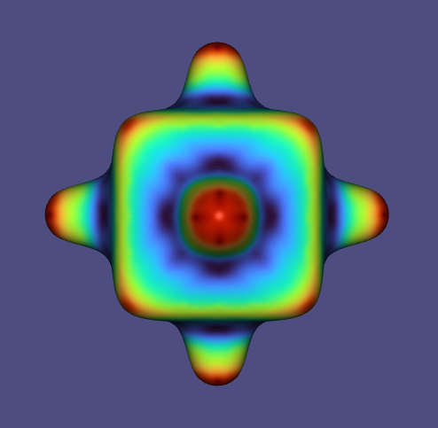
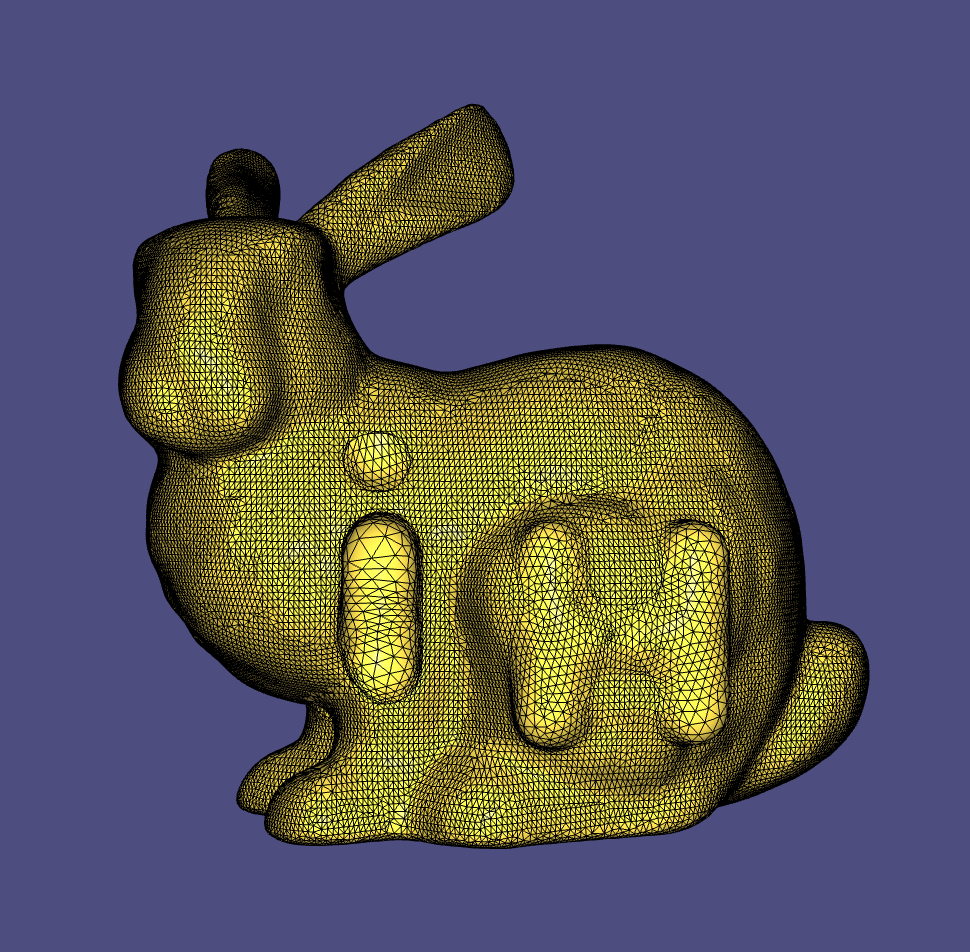
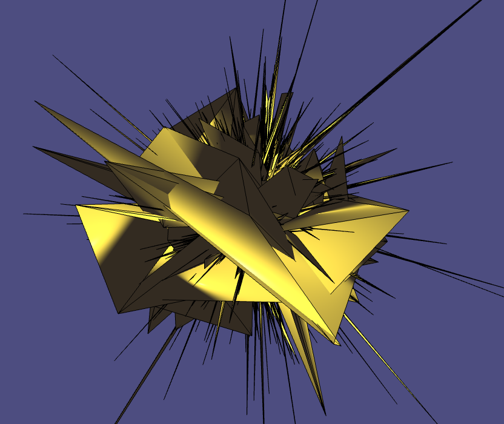
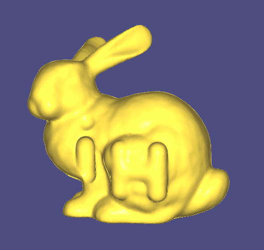

# Assignment 3

Name: 'Di Zhuang'

Legi-Nr: '21958772'

## Required results
Edit this 'README.md' file to report all your results. You only need to update the tables in the reports section by adding screenshots and reporting results.

### Mandatory Tasks
1) Show the screenshots of mesh **torus.obj** and the mesh **Julius.obj** from the data folder shaded with the 5 different normals. For the PCA and quadratic fitted normals show them each with both k=1 and k=2. Note that here k means k-ring neighbors.

2) Report your matching between curvature expressions and the figures. Provide a short motivation for your matchings.

3) Show screenshots of mesh **bumpy-cube.obj** from the data folder coloured according to the 4 discrete curvature measures.

4) Report your findings on the differences between implicit and explicit Laplacian smoothing, the differences between uniform vs cotangent weights and report the parameters you used and how changing them affects the result. Also show screenshots of both the implicit and explicit Laplacian smoothing results for mesh **bunny_noise.obj** from the data folder.

5) Report your findings on the comparison with results you obtained with the Laplacian smoothing vs with bilateral smoothing. Show screenshots of bilateral smoothing applied to mesh **bunny_noise.obj** from the data folder.

## Reports
### 1 - Shading w.r.t. different normals

**Use the mesh torus.obj and the mesh Julius.obj**

**Use the built-in function igl::per_vertex_normals() to orient your normals consistently**

| normals        | torus.obj                  | Julius.obj                 |
| :-----------:  | ------------------------------------- |------------------------------------- |
| standard       ||  |
| area-weighted  ||  |
| mean-curvature ||  |
| PCA (k=1)      ||  |
| PCA (k=2)      ||  |
| quadratic (k=1)||  |
| quadratic (k=2) ||  |

### 2 - Matching curvature expressions and the figures
| expression   |  Your answer |  Your explanation   |
|--------------|--------------|------------------|
| k1           | d      | The function is even and positive, indicateing that the curvature expression is symmetric, and the curvature is always greater than zero, so there is no straight part along the curvature expression. |
| k2           | c      | The function is odd, indicating that the curvature expression is not symmetric. |
| k3           | a      | The function is even, and it is non-negative, indicating that the curvature expression is symmetric, and it does not cross. |
| k4           | b      | The function is even, and it changes from positive to negative and to positive as **s** increases from negative to positive, , indicating that the curvature expression is symmetric, and it crosses three times. |

### 3 - Visualize curvatures

**Use the mesh bumpy-cube.obj**

| Min Curvature                         |  Max Curvature                       |
| ------------------------------------- |------------------------------------- |
||  |
| Mean Curvature                        |  Gaussian Curvature                  |
||  |

### 4 - Implicit v.s. explicit Laplacian Smoothing

**Use the mesh bunny_noise.obj**

**Try different laplacian matrices, step sizes and iterations**
| Input  |  Implicit (cotangent, #iteration = 10, dt*lambda = 0.00001)    |  Implicit (cotangent, #iteration = 20, dt*lambda = 0.00001)          | Implicit (cotangent, #iteration = 20, dt*lambda = 0.001)          |
| -------|----------------------------- |------------------------------------|---------------------------------- |
||  | | |

| Input  |  Implicit (uniform, #iteration = 100, dt*lambda = 0.001)    |  Implicit (uniform, #iteration = 200, dt*lambda = 0.001)          | Implicit (uniform, #iteration = 200, dt*lambda = 0.1)          |
| -------|----------------------------- |------------------------------------|---------------------------------- |
||  | | |

Your observations: In comparison to cotangent-weighted laplacian, uniform-weighted laplacian does not preserve the geometry very well when the triangle density is not uniform along the mesh. This can be seen from the third column, where for uniform-weighted laplacian, the "Hi" on the resulting mesh disappears. As #iteration and dt\*lambda increase, the resulting mesh becomes more and more smooth. However, aggressive value of dt\*lambda can lead to unnatural shrinkage of the mesh.

| Input  |  Explicit (cotangent, #iteration = 40, dt*lambda = 0.01)    |  Explicit (cotangent, #iteration = 40, dt*lambda = 0.00001)          | Explicit (cotangent, #iteration = 100, dt*lambda = 0.00001)          |
| -------|----------------------------- |------------------------------------|---------------------------------- |
||  | | |

| Input  |  Explicit (uniform, #iteration = 40, dt*lambda = 0.01)    |  Explicit (uniform, #iteration = 100, dt*lambda = 0.01)          | Explicit (uniform, #iteration = 100, dt*lambda = 0.09)          |
| -------|----------------------------- |------------------------------------|---------------------------------- |
||  | | |

Your observations: Similar to the implicit case, in comparison to cotangent-weighted laplacian, uniform-weighted laplacian does not preserve the geometry very well when the triangle density is not uniform along the mesh. This can be seen from the third column, where for uniform-weighted laplacian, the "Hi" on the resulting mesh disappears. In addition, given the same parameters, cotangent-weighted laplacian tend to explode, while uniform-weighted laplacian is more stable. This can be seen from the first column. As #iteration and dt\*lambda increase, the resulting mesh becomes more and more smooth. However, aggressive value of dt\*lambda can lead to explosion of the mesh due to the numerically unstable nature of explicit smoothing.

### 5 - Laplacian v.s. bilateral smoothing

**Use the mesh bunny_noise.obj**

| Input                                 |  Laplacian Smoothing                 |  Bilateral Smoothing                 |
| ------------------------------------- |------------------------------------- |------------------------------------- |
||  | |

Your observations: bilateral smoothing preserves more features (e.g. the fur curve).
